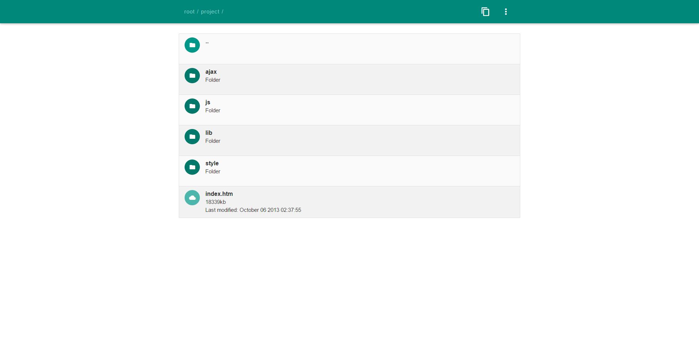

Filenode is an file explorer based in php and javascript, that uses the server its hosted on as filesystem. It's easy to install and easy to use, requiring no database and minimal disc space.

You can use filenode to allow visitors, clients, team members or other people to browse specified directories and files. There is an option to black- or whitelist directories if you want to restrict the files and folders, that can be accessed.

## Easy installation
Having a size of around 25kb, filenode has an extremely small size. It also does not require any database, which makes it very fast to set up and allows multiple filenode installations on the same server.

## Secure
There's a whitelist feature built in. It's easy to define which directories can be accessed and which cannot.

## Different views
There are three ways of listing files in filenode: list, default and large. List shows most elements in the smallest space, default adds filesize and last-viewed information and large shows thumbnails of images.

## File viewers
Filenode includes fileviewers to show code, images, video and audio directly in the file explorer. Also code will be highlighted using [highlight.js](http://highlightjs.org/)

# Setup
Filenode is extremely easy to set up! Just make sure to use an server that does support PHP 5+ and you're good to go. There is no installation file, so after copying the files on your server it is pretty much good to go.

If the server is public it is important to change the login settings, as they are the same on every new filenode installation. To do that, click on login in the menu on the top right, and log in using "admin" as username and "admin" as password. Then click on the menu button again and then on settings. Here you can change the your login credentials, the default path that's being used for the file explorer, the color scheme, white- and blacklist and more.

